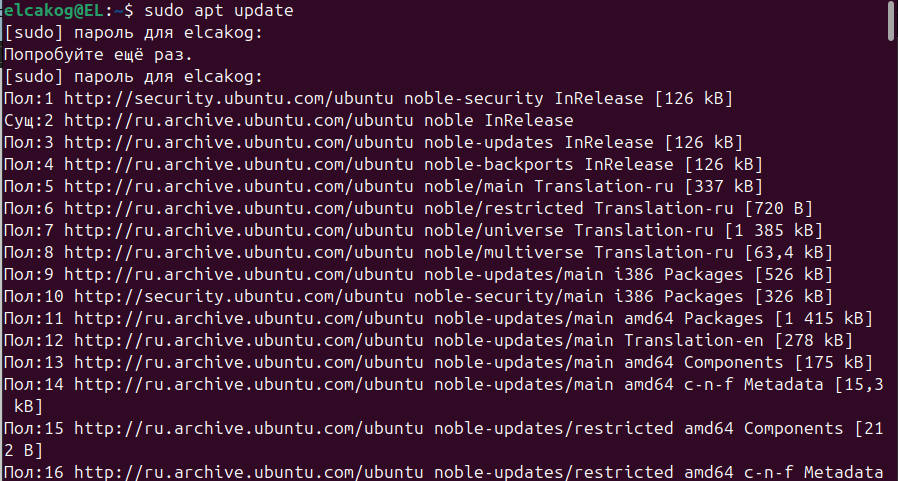
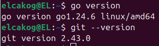
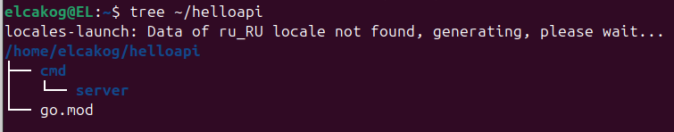
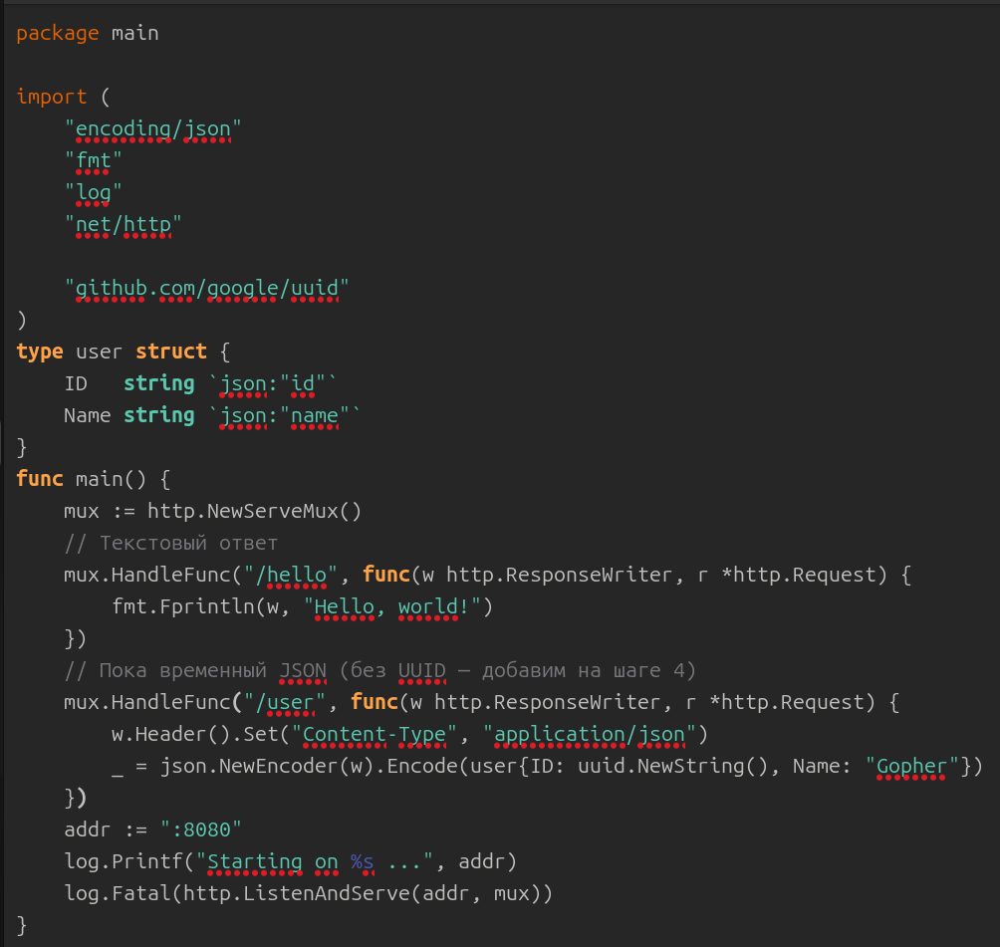
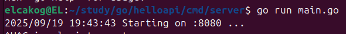
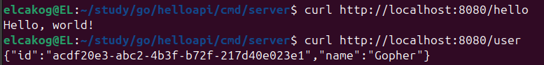
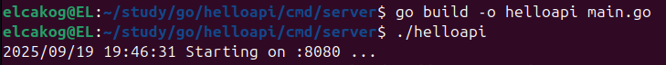
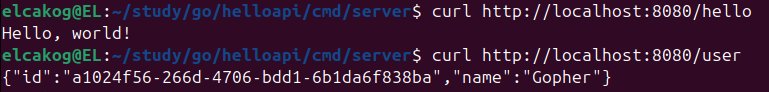
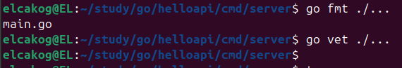

# Практическое задание 1

Студент группы *ЭФМО-02-25 
Пягай Даниил Игоревич*

## Описание

**Цель:** Развернуть рабочее окружение Go на Windows, создать минимальный HTTP-сервис на net/http, подключить и использовать внешнюю зависимость, собрать и проверить приложение.

**Задание:** 
- Установить Go и Git, проверить версии
- Инициализировать модуль Go в новом проекте
- Реализовать HTTP-сервер с маршрутами /hello (текст) и /user (JSON)
- Подключить внешнюю библиотеку (генерация UUID) и использовать её в /user
- Запустить и проверить ответы curl/браузером
- Собрать бинарник .exe и подготовить README и отчёт.

## 1.Подготовка окружения и проверка версий
- Отрываем Terminal
- Устанавливаем Golang-go и Git (если не установлено)

```bash
sudo apt update
sudo apt install golang-go git -y
```



## Проверяем версии

```bash
go version
git --version
```



## Структура проекта и модуль Go

```bash
mkdir -p ~/helloapi/cmd/server
cd ~/helloapi
```

## Инициализация модуля Go

```bash
go mod init example.com/helloapi
```
После инициализации модуля в древовидной структуре появится go.mod



## Создаём минимальный HTTP-сервер:

Путь файла study/go/helloapi/cmd/server/main.go.



**Пояснения**:

- `http.NewServeMux()` - простой роутер из стандартной библиотеки.
- Для JSON всегда выставляем заголовок `Content-Type: application/json`.
- Используется порт 8080.

## Подключение внешней зависимости и доработка /user

Подтянем пакет для генерации UUID и заменим «temp» на реальный идентификатор:

```bash
go get github.com/google/uuid@latest
go mod tidy
```
Заменим "temp" в study/go/helloapi/cmd/server/main.go.на реальный идентификатор.

```go
import "github.com/google/uuid"
// ...
mux.HandleFunc("/user", func(w http.ResponseWriter, r *http.Request) {
    w.Header().Set("Content-Type", "application/json")
    _ = json.NewEncoder(w).Encode(user{
        ID:   uuid.NewString(), // теперь реальный UUID
        Name: "Gopher",
    })
})
```

В корне проекта появился файл go.sum,
который фиксирует точные версии зависимостей.

## Запуск сервера и быстрая проверка

```bash
cd ~/helloapi
go run main.go
```


Проверка:

```bash
curl http://localhost:8080/hello
curl http://localhost:8080/user
```



## Сборка бинарника и повторная проверка

```bash
go build -o helloapi main.go
./helloapi
```




Ответы `curl` совпадают с предыдущим шагом.

## Код-стайл

```bash
go fmt ./...
go vet ./...
```



## Структура проекта:

```text
helloapi/
├── cmd/
│   └── server/
│       └── main.go
├── go.mod
└── go.sum
```
